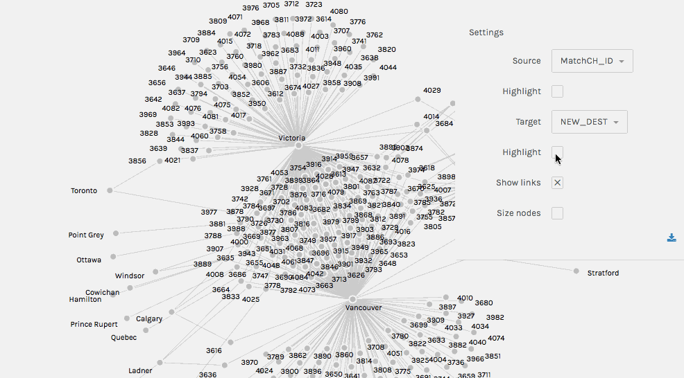

# By Sarah Zhang 

## Introduction

I used [Palladio](http://hdlab.stanford.edu/palladio/), a tool for exploring humanities data, to examine the migration patterns hidden in the Chinese Head Tax Data, which dates back over a century. The exploration was driven by this inquiry: What new possibilities for the study of early Chinese immigrants to Canada could this dataset offer if new DH tools were employed?

Well, it turned out there’s a hidden goldmine that hasn’t been discovered!

While Palladio seems to be a really easy-to-use tool, I found myself, when I drilled into the visualization based on the data, perplexed by some deceptively obvious characteristics of the graph, such as the nodes' size, the connections, and their relationships. Once I tackled these puzzles, I gained an entirely new understanding of the graph, which interestingly led to more research questions that can be asked about the graph below.

  

 This work is licensed under a <a rel="license" href="http://creativecommons.org/licenses/by-sa/4.0/">Creative Commons Attribution-ShareAlike 4.0 International License</a>.
